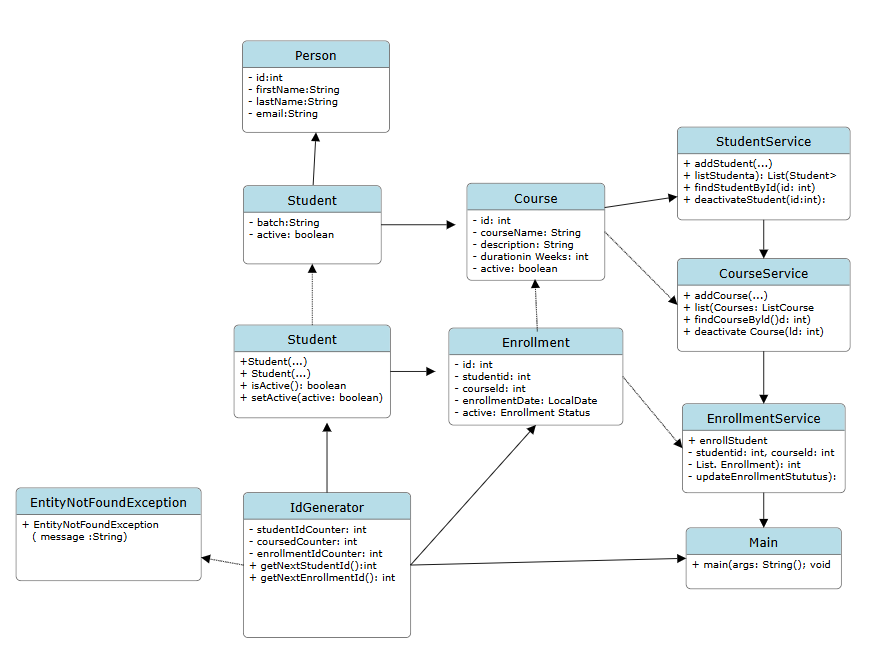

# LearnTrack – Student & Course Management System

This is a Java console-based mini project developed for understanding core Java and OOP concepts.
Using this program, we can manage Students, Courses and Enrollments. The project was built step-by-step while learning packages, classes, ArrayList, constructors, inheritance, and exception handling.

This project runs in the terminal using simple menu options.

---

## 1. Features of the Project

### Student Management

* Add a new student
* View all students
* Students are active by default

### Course Management

* Add a new course
* View all courses

### Enrollment Management

* Enroll a student into a course
* View enrollments (via service methods)

---

## 2. Technologies Used

* **Language:** Java
* **JDK:** Version 8 or above
* **Collections Used:** ArrayList
* **OOP Used:** Encapsulation, Inheritance, Polymorphism, Static methods, Constructors, Custom Exception

---

## 3. How to Run This Project

1. Install **JDK** on your system.
2. Clone or download this project folder.
3. Open it in any editor (VS Code, IntelliJ, Eclipse or simple terminal).
4. Navigate to the source folder and compile using:

```
javac airtribe/learntrack/src/Main.java
```

5. Run the program:

```
java airtribe.learntrack.src.Main
```

6. You will see a menu like:

```
1 Add Student
2 View Students
3 Add Course
4 View Courses
5 Enroll Student
0 Exit
```

Enter the number to perform an operation.

---

## 4. Project Structure

```
airtribe/learntrack/src
    ├── Main.java
    ├── entity/
    ├── service/
    ├── exception/
    ├── util/
    ├── enums/
    └── constants/
    └── docs/
```

Each folder has a specific responsibility which keeps the project clean and understandable.

---

## 5. Class Diagram (Simple Overview)


---

## 6. Documentation Files

The project contains documentation as required:

| File                       | Description                                           |
| -------------------------- | ----------------------------------------------------- |
| docs/Setup_Instructions.md | JDK setup and Hello World proof                       |
| docs/JVM_Basics.md         | Explanation of JVM, JDK, JRE, Bytecode                |
| docs/Design_Notes.md       | Why ArrayList, where static used, inheritance reasons |
| README.md                  | Main project documentation                            |

---

## 7. What I Learned While Building This Project

* How to create packages and maintain folder structure
* Creating classes with private fields and getters/setters
* Constructor overloading
* Using ArrayList instead of normal arrays
* Using static methods to generate IDs
* Applying inheritance (Person → Student)
* Handling exceptions without program crash
* Console-based application development

---
This project helped me understand core Java concepts in a practical way. The focus was to write clean, simple code that I as a beginner could understand and learn from.

---
